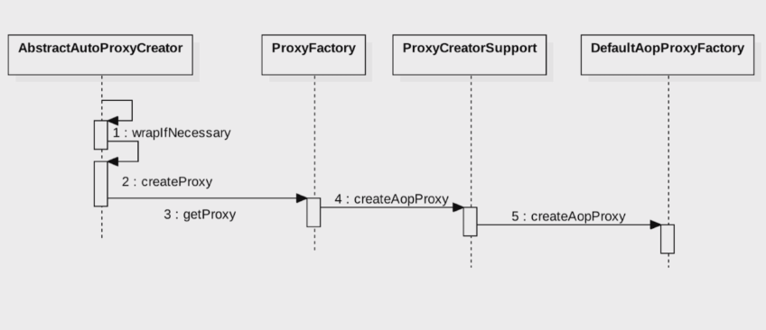

#基本介绍

###织入的时机 
1: 编译期（AspectJ）
2: 类加载时（AspectJ 5+）
3: 运行时（Spring AOP）
####代理模式

1: 静态代理(缺点：重复实现较多)
___
```
创建接口 Subject; 接口实现类RealSubject实现其中方法，执行时用代理类Proxy执行，
不破坏RealSubject内中的实现。
public class RealSubject implements Subject{
    @Override
    public void request() {
        System.out.println("real subject execute request");
    }

    @Override
    public void hello() {
        System.out.println("hello");
    }
}

public class Proxy implements Subject{

    private RealSubject realSubject;

    public Proxy(RealSubject realSubject) {
        this.realSubject = realSubject;
    }

    @Override
    public void request() {
        System.out.println("before");
        try{
            realSubject.request();
        }catch (Exception e){
            System.out.println("ex:"+e.getMessage());
            throw e;
        }finally {
            System.out.println("after");
        }
    }

 public static void main(String[] args){
        Subject subject = new Proxy(new RealSubject());
        subject.request();
    }
```
2: JDK动态代理 (只能针对有接口的类的接口方法进行代理)
___
```aidl
public class JdkProxySubject implements InvocationHandler{

  @Override
    public Object invoke(Object proxy, Method method, Object[] args) throws Throwable {
        System.out.println("before");
        Object result = null;
        try{
            result = method.invoke(realSubject,args);
        }catch (Exception e){
            System.out.println("ex:"+e.getMessage());
            throw e;
        }finally {
            System.out.println("after");
        }
        return result;
    }
}
  Subject subject = (Subject) Proxy.newProxyInstance(Client.class.getClassLoader(),new Class[]{Subject.class},new JdkProxySubject(new RealSubject()));
        subject.hello();
        subject.request();
```
 3: Cglib代理（基于继承来实现代理，无法对private，static，final类进行代理）
 ```aidl
public class DemoMethodInterceptor implements MethodInterceptor{
    @Override
    public Object intercept(Object obj, Method method, Object[] args, MethodProxy proxy) throws Throwable {
        System.out.println("before in cglib");
        Object result = null;
        try{
            result = proxy.invokeSuper(obj, args);
        }catch (Exception e){
            System.out.println("get ex:"+e.getMessage());
            throw e;
        }finally {
            System.out.println("after in cglib");
        }
        return result;
    }
}
  Enhancer enhancer = new Enhancer();
        //生成指定类对象的子类，也就是重写类中的业务函数
        enhancer.setSuperclass(RealSubject.class);
        //这里是回调函数，加入Interceptor()函数
        enhancer.setCallback(new DemoMethodInterceptor());
        //创建这个子类对象
        Subject subject = (Subject) enhancer.create();
        subject.hello();
```
####spring代理类创建流程图



1: 如果目标对象实现了接口，则默认采用jdk代理
2: 如果目标对象没有实现接口，则采用Cglib进行动态代理
3: 如果目标对象实现了接口，且强制Cglib代理，则使用Cglib代理

